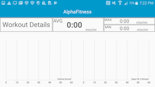

# NanoFitness

 Mobile application that helps users keep track of statistics gathered from working out

## Screenshots

 
 
 
 
 
 
## Demo
 
 https://youtu.be/y28a2EhFTko
 
## Dependencies

The application requires a GoogleMaps API key to be built. You can create one at the [google developers console](console.developers.google.com)  
Then you must go to your home directory on your computer and navigate to the .gradle folder and add the key to  
gradle.properties, if gradle.properties is not there, then create it using this format: NanoFitness_ApiKey="gmaps_api_key"  
where gmaps_api_key is the key you created  